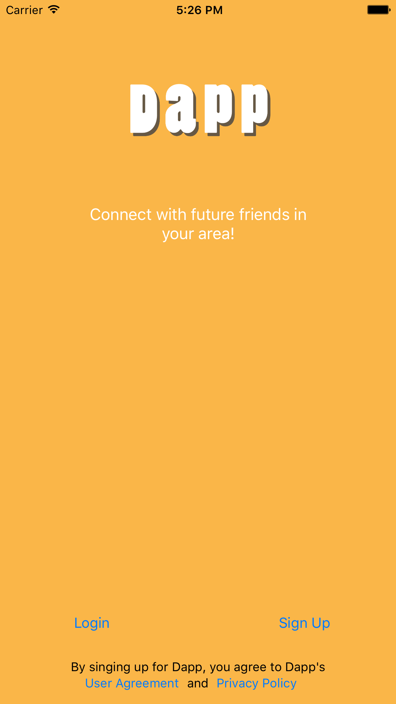

# Dapp
Version 1.0 - Released to App Store

## Description

Dapp is a social application that allows groups of friends to connect with other groups of friends to hang out. Typically a group of friends who want to meet others with a similar interest can create a profile broadcast their interest and availability to other groups on the app. Groups that are created are posted on a map where you can see the proximity of other groups near you. You can invite other groups to chat to plan and meet up with them!

## Preview Images

